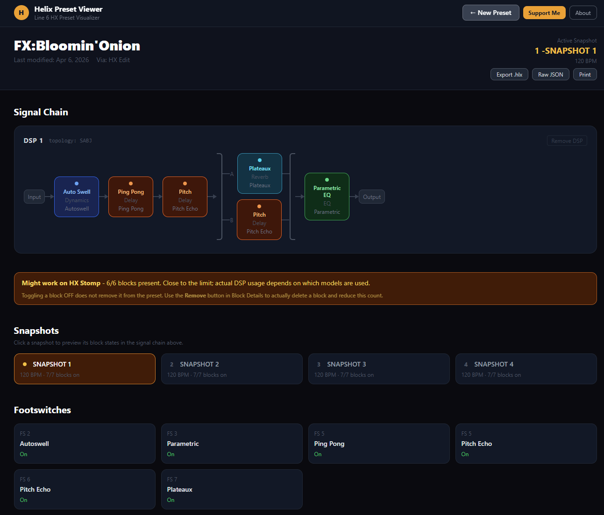

# Helix Preset Viewer

A free, open-source visualizer and editor for Line 6 Helix / HX Stomp / HX Effects preset files (`.hlx`), with read-only support for Bass PODxt / PODxt family presets (`.l6t`).

HX Edit only shows a preset once it is loaded onto a connected device. This shows any preset file in the browser, so you can see what a downloaded or shared preset does, compare snapshots, and make quick edits without the hardware.

Upload a preset file to explore its signal chain, block parameters, snapshots, footswitch assignments, IR slots, and MIDI/controller mappings, all in your browser, no account required.




## Features

- **Signal chain visualization**: see DSP 1 and DSP 2 blocks laid out in order, including parallel A/B paths
- **Block details**: exact model names, parameter names, units and ranges from HX Edit's own model database (677 models); values changed from the model default are highlighted, and hovering shows the default and range
- **Edit parameters in real units**: enter dB, ms, Hz, % or knob values just like HX Edit; out-of-range values are clamped to the model's limits
- **Snapshot switching**: click any snapshot to preview how blocks change state across snapshots
- **Toggle blocks on/off**: change block state within the active snapshot
- **Remove blocks / DSPs**: soft-mark blocks for removal (shown with strikethrough); removed blocks are excluded when exporting
- **Export modified preset**: download the modified `.hlx` file with your changes applied
- **HX Stomp compatibility check**: warns when a preset exceeds the Stomp's 8-block limit or uses models the Stomp doesn't have
- **Convert Helix presets to HX Stomp / Stomp XL** — merge DSP 1 and DSP 2 into a single chain, remove blocks down to the 8-block limit, then convert. Snapshots, expression pedal assignments and block states carry over; Helix-only settings are dropped and footswitch assignments are listed for you to reassign
- **IR slot viewer**: see which impulse response slots are used and their UUIDs
- **MIDI / controller assignments**: view CC and controller mappings
- **Footswitch assignments**: see which footswitch controls each block
- **Print view**: print-friendly layout via browser print (`Ctrl+P`)
- **Session restore**: last loaded preset is saved in local storage and restored on next visit
- **PODxt presets (`.l6t`)**: view the signal chain and every block's parameters, with per-model parameter names and units


## How to Use

1. **Open the app** in your browser (see deployment options below).
2. **Drop a `.hlx` or `.l6t` file** onto the upload area, or click **Choose File** to browse.
3. The signal chain, block details, snapshots, and other sections load automatically.

### Working with blocks

- **Click a block chip** in the signal chain to scroll to its detail card.
- **ON / OFF button**: toggles the block in the active snapshot without affecting other snapshots.
- **Remove button**: marks the block for removal on export (strikethrough). Click **Undo Remove** to restore it. The block stays in view until you export.
- **Remove DSP**: marks an entire DSP path for removal. The chain collapses to a stub; click **Restore DSP** to undo.
- **Edit button**: edit parameters in the units HX Edit shows. Dropdown params (mic, note sync, ratio, etc.) show their real options. Amp+Cab blocks include the cab's params. Click **Save** to apply.

### Snapshots

- Click any snapshot card to switch the active snapshot. Block states in the signal chain update to reflect that snapshot.
- The active snapshot is shown with an amber dot indicator.

### Converting a Helix preset to HX Stomp / Stomp XL

HX Edit refuses to load Helix Floor/LT/Rack presets on a Stomp. To convert one:
1. Load the Helix preset. The compatibility banner shows the combined block count of both DSPs.
2. Click **Remove** on blocks until you're at 8 or fewer.
3. Pick **HX Stomp XL** (4 snapshots) or **HX Stomp** (3 snapshots) and click **Merge DSPs & Convert**.
4. Review the result, reassign footswitches listed in the blue box, then **Export .hlx** and import it with HX Edit.

The conversion is unofficial. DSP usage isn't checked, so a preset under 8 blocks can still be too heavy for the Stomp's single DSP.

### Exporting

Click **Export .hlx** to download the preset with your changes applied:
- Toggled ON/OFF states are saved.
- Edited parameter values are saved.
- Removed blocks and DSPs are permanently deleted from the exported file.


## Deployment

### Docker (recommended)

Clone the repo and run with Docker Compose:

```bash
git clone https://github.com/adman234/helix-viewer.git
cd helix-viewer
docker compose up -d
```

The app will be available at `http://localhost:7860`.

Uploaded preset files are saved to `./uploads/` on the host.

### Unraid

Use the docker-compose above, or add the container manually:

- **Image:** `ghcr.io/adman234/helix-viewer:latest`
- **Port:** `7860:80`
- **Volume:** Map container path `/uploads` to a host path (e.g. `/mnt/user/appdata/helix/uploads`) to persist uploaded and exported preset files.

### Running locally (no Docker)

Open `html/index.html` directly in any modern browser. The upload persistence backend won't be available, but all other features work fully client-side.

### Updating the model database

Model and parameter definitions live in `html/models.js`, generated from the JSON files HX Edit installs (`res/*.models`, `HX_ModelCatalog.json`, `HelixControls.json`). After updating HX Edit for a new firmware release, regenerate it:

```bash
python tools/build_models.py
```

On Windows it reads `C:\Program Files (x86)\Line6\HX Edit\res` by default; pass a different path as the first argument if needed.


## Privacy

Preset files are parsed entirely in your browser. No data is sent to any external server. If the backend upload service is running (Docker deployment), uploaded files are saved locally to the `/uploads` directory on your own host only.


## Legal

This project is not affiliated with, endorsed by, or connected to Line 6, Inc. or Yamaha Corporation in any way. "Helix", "HX Stomp", "HX Edit", and related names are trademarks of their respective owners. Preset files are the property of their creators. Use at your own risk.


## Support

If you find this useful, you can [buy me a coffee](https://ko-fi.com/adman234).

Found a bug? [Open an issue](https://github.com/adman234/helix-viewer/issues/new).
